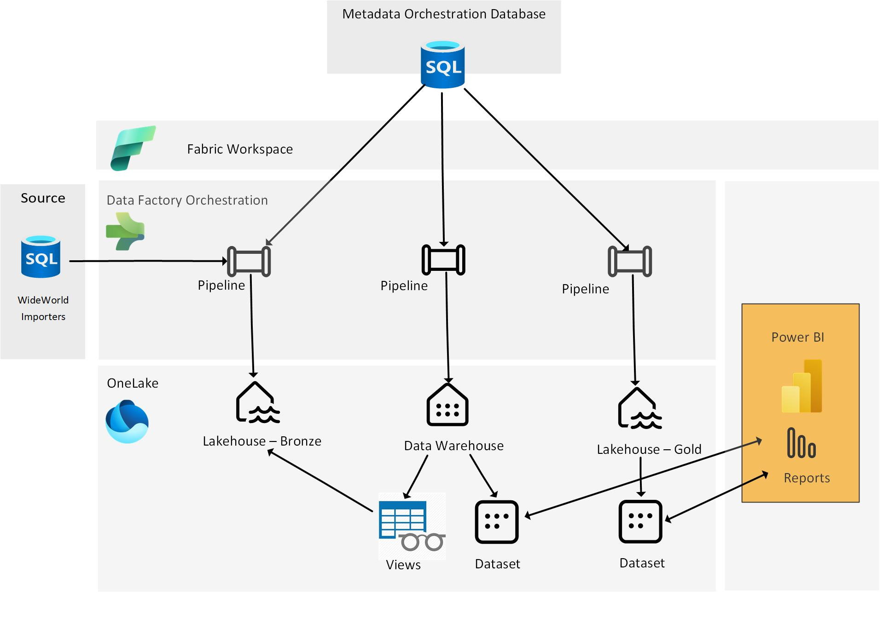
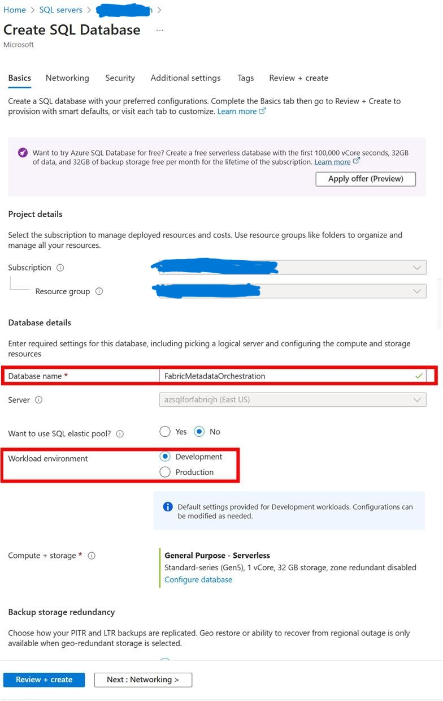
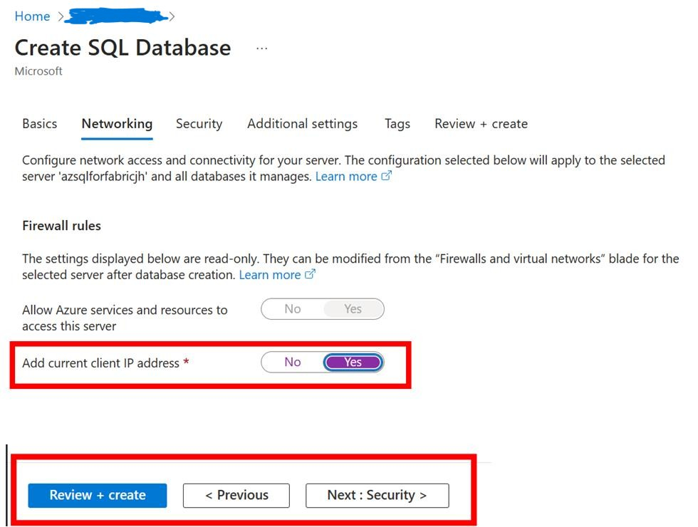

# Tutorial: Build Metadata Driven Pipelines in Microsoft Fabric

## Description

Metadata-driven pipelines in Azure Data Factory, Synapse Pipelines, and now, Microsoft Fabric, give you the capability to ingest and transform data with less code, reduced maintenance and greater scalability than writing code or pipelines for every data source that needs to be ingested and transformed. The key lies in identifying the data loading and transformation pattern(s) for your data sources and destinations and then building the framework to support each pattern.

In August 2023, I created 2 blog posts on Metadata Driven Pipelines with Fabric. Both involve landing the data in a Fabric Lakehouse and building a Star Schema for the Gold Layer. [The first post](https://techcommunity.microsoft.com/t5/fasttrack-for-azure/metadata-driven-pipelines-for-microsoft-fabric/ba-p/3891651) illustrates creating the Star Schema in a Fabric Lakehouse. [The second post](https://techcommunity.microsoft.com/t5/fasttrack-for-azure/metadata-driven-pipelines-for-microsoft-fabric-part-2-data/ba-p/3906749) covers using a Fabric Data Warehouse for the Star Schema and why you may want to choose this option. 

This tutorial is a companion to the Metadata Driven Pipelines in Fabric posts. The intent is to provide step-by-step instructions on how to build the Metadata Driven Pipelines described in those blogs. The reason is 2-fold - this will help you better understand Microsoft Fabric, but also because Fabric is not fully integrated with Git at this time. There are no ARM templates to deploy like in Azure Synapse or Data Factory. However, when Fabric supports Git integration with Pipelines and Connections, we will create another pattern which will allow you deploy all Fabric artifacts into your own Fabric tenant.

## Architecture

Below is a high level architecture diagram of what you will build in this tutorial: 
## Prerequisites
* Permissions to create the Azure Resource Group, Azure Storage Account, Azure SQL Server and Azure SQL DBs needed for this tutorial.
* Permissions to create a Microsoft Fabric Workspace
* SQL Server Management Studio or Azure Data Studio
* Basic understanding of creating data pipelines, either from Azure Data Factory, Synapse Analytics or Microsoft Fabric.
## Create Azure Resources
Create an Azure Resource Group, Storage Account, and Azure SQL DBs needed for this tutorial.
### Create an Azure Resource group 
 [Follow the instructions here](https://learn.microsoft.com/en-us/azure/azure-resource-manager/management/manage-resource-groups-portal), if neccessary, to create your resource group.
### Create an Azure Storage account
Create a blob storage account in the resource group created in the previous step. [Follow the instructions here](https://learn.microsoft.com/en-us/azure/storage/common/storage-account-create?tabs=azure-portal), if necessary, to create your blob storage account. This will be used to restore the Wide World Importers database.
### Create an Azure SQL Server
1. In the Azure Portal, in **Create a resource**, choose **SQL Server** and click **Create.**
1. Choose your **Subscription**
1. Choose you **Resource group** you created in the previous step
1. Enter a **Server name** - note this must be unique across all azure
1. Choose your **location**
1. For authentication method, select **Use both SQL and Microsoft authentication**
1. Click the **Set admin** button and select your user account
1. Enter a **Server admin login and password**. Your screen should similar to the one below: 
1. Navigate to the **Networking** tab and change the slider under Firewall rules to **Yes** to allow Azure services and resources to access this server.
1. Select **Review + create**
### Create an Azure SQL DB for Metadata Driven Pipeline Configurations
1. Go to the Azure SQL Server you created in the previous step and click **Create database**
1. Make sure your resource group and SQL server are selected. Enter **FabricMetadataOrchestration** for the database name.
1. For **Workload environment** Choose **Development**
1. Navigate to **Networking** and under **Firewall rules**, move slider for **Add current client IP address** to **Yes** 
1. Click **Review and create**
### Download and restore the Wide World Importers Database
1. Download the Wide World Importers Database for Azure SQL DB. [Click here to immediately download the bacpac](https://github.com/Microsoft/ql-server-samples/releases/download/wide-world-importers-v1.0/WideWorldImporters-Standard.bacpac)
1. Upload the bacpac to the storage account created previously and restore the Wide World Importers database. [Follow the instructions here](https://learn.microsoft.com/en-us/azure/azure-sql/database/database-import?view=azuresql&tabs=azure-powershell), if necessary, to restore the database from the bacpac.
## Create Azure SQL DB Objects
Run scripts to create views, tables and stored procedures used in this tutorial.
### Create views in Wide World Importers database
1. Download the SQL script found in [in this repo](src/sql/1-wwi/create_source_views.sql).
1. Connect to the Wide World Importers Database in SQL Server Management Studio or Azure Data Studio
1. Run the script to script to create the views. You should see the following views as shown in Object Explorer below: 
### Create and load tables in the Metadata database
1. Download the SQL script found in [in this repo](src/sql/2-metadatadb/create-metadata-tables.sql)
1. Connect to the FabricMetadataOrchestration database in SQL Server Management Studio or Azure Data Studio
1. Run the script to script to create and load the tables. You should see the following tables as shown below: 
## Create Microsoft Fabric Resources
Create the Microsoft Fabric Workspace, Lakehouses, Data Warehouse, and Azure SQL DB Connections.
### Create a Microsoft Fabric workspace
[Create a Fabric Workspace](https://learn.microsoft.com/en-us/fabric/get-started/create-workspaces) in your Microsoft Fabric tenant
### Create Bronze and Gold Fabric Lakehouses
[Create 2 Microsoft Fabric Lakehouses](https://learn.microsoft.com/en-us/fabric/data-engineering/create-lakehouse) in you workspace.
After creating the Lakehouses, copy the lakehouse names and table URLs and keep for your reference. 
* To get the URLs, open each Lakehouse and click on the ellipses next to the **Tables** folder. Choose **Properties** and copy the abfss file path. [getlakehouse](images/get_lakehouse_url.jpg)
* Paste each into notepad or a Word document and remove the "/Tables" from the end of the string. Your string will look something like **abfss://\<uniqueid>@onelake.dfs.fabric.microsoft.com/a\<anotheruniqueid>**
### Create a Fabric Data Warehouse
Create a Fabric Data Warehouse by [following the instructions here](https://learn.microsoft.com/en-us/fabric/data-warehouse/create-warehouse)
### Create Fabric Connections to your Azure SQL DBs
Create 2 Fabric connections, one to the Wide World Importers Azure SQL DB and to the FabricMetadataConfiguration Azure SQL DB. [per the instructions here](https://learn.microsoft.com/en-us/fabric/data-factory/).
### Upload Spark Notebooks to Fabric
Upload the notebooks to be used in the pipeline
1. Download the 3 notebooks [found in the repo](src/notebooks/)
1. Log into the Microsoft Fabric portal and switch to the Data Science experience and click 
1. Select upload and choose all of the 3 notebooks 

## Create Microsoft Fabric Pipelines and Activities
From this point forward, the instructions will be an exercise of creating pipelines, adding activities and configuring the settings for each activity. The configurations for each activity are in a format that allows you to copy and paste values into each activity. It is important to copy the text exactly as is to avoid errors in scripts or subsequent activities. Do to the length of the instructions, I am keeping images in this post to a minimum - another reason to follow the instructions carefully. You can also refer to the original blog posts cited at the tops of this blog post for reference.
### Create the pipeline to load data from Wide World Importers to the Fabric Lakehouse
This pipeline loops through the tables defined in Lakehouse table to load from World Wide Importers to the Fabric Lakehouse
* Create a new Data Pipeline and call it "Get WWImporters Data direct"
* Add a Set variable activity
* Click on the canvas and add the following parameters:

| Name                | Type   |
| ------------------- | ------ |
| sqlsourcedatecolumn | String |
| sqlstartdate        | String |
| sqlenddate          | String |
| sqlsourceschema     | String |
| sqlsourcetable      | String |
| sinktablename       | String |
| loadtype            | String |
| sourcekeycolumn     | String |
| batchloaddatetime   | String |

