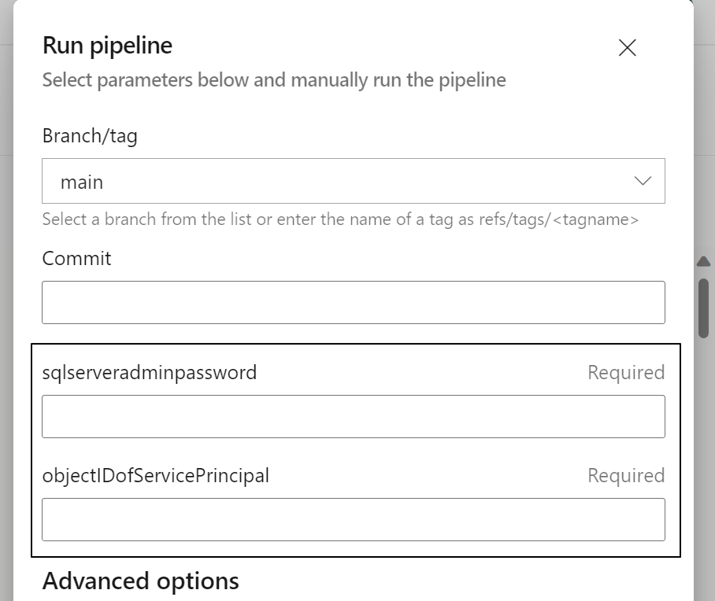
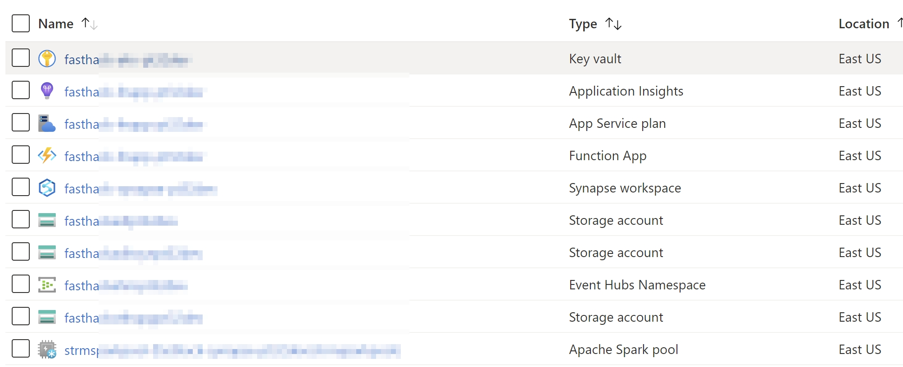
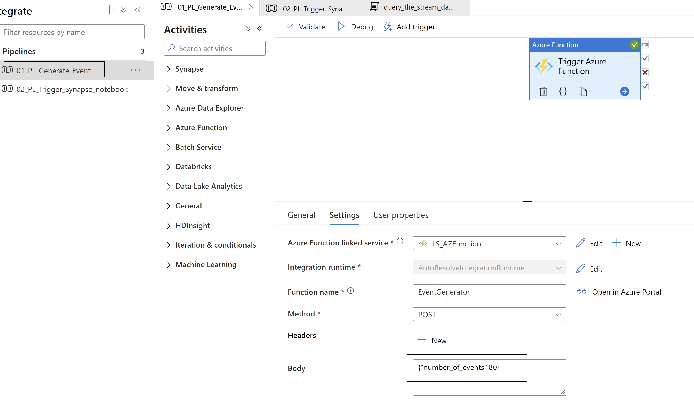
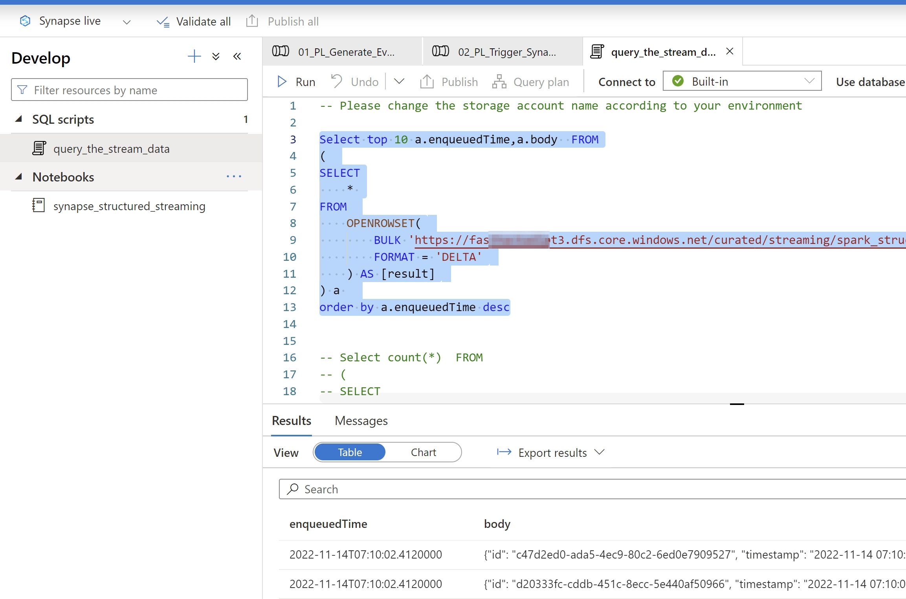

# Pattern 3: Azure Synapse Data Lake Demo Environment (Streaming)

## Prerequisites
* An active Azure subscription.
* An active Azure DevOps account.
* Service Principal that has "Owner" privilege over your subscription so that it can create a new resource group and resources during the deployment.
If "Owner" cannot be given, then assign it to a custom role which has access to the following:   Microsoft.Authorization/roleAssignments/
* [Create an Azure Resource Manager service connection](https://docs.microsoft.com/en-us/azure/devops/pipelines/library/service-endpoints?view=azure-devops&tabs=yaml#create-a-service-connection) from the Azure DevOps pipeline to connect the Azure subscription. 
* [Create a github service connection](https://docs.microsoft.com/en-us/azure/devops/pipelines/library/service-endpoints?view=azure-devops&tabs=yaml#github-service-connection) to connect to the github repo.

## Architecture
Below is a high-level diagram of the solution.

## Azure Resources
Here are the Azure resources that are being deployed for the streaming pattern. 

1. **Azure Function App** - The Azure function app is going to generate events. In real-world scenarios, the function can be replaced with IoT hub or any kind of event generator.
1. **Event Hub** - Azure Event Hub is a big data streaming platform and event ingestion service. It can receive and process millions of events per second. In this scenario, the Event hub is receiving data from the Azure function app.
1. **Azure Synapse Workspace** - The following components from the Azure Synapse workspace are being used:
   - *Azure Synapse Spark Notebook*: The Notebook will leverage Spark structured streaming to process the streaming data.
   - *Azure Synapse Spark Pool*: The compute to run the Spark Notebook.
   - *Azure Synapse Pipeline*: The pipeline is used to orchestrate the solution.
   - *Azure Synapse Serverless SQL pool*: A T-SQL endpoint to query the delta tables hosted on Azure Data Lake Storage v2.
1.  **Azure Data Lake Storage v2 (ADLSv2)** - Location to store the ingested data in delta format.
1.  **Azure Key Vault** - Secret store.
1.  **Azure Devops pipeline** - A CI/CD pipeline to deploy all of the components in the solution to Azure.

## Deployment Steps
1. Clone or fork the repo: https://github.com/Azure/AnalyticsinaBox/tree/main/src/bicep-deployment/Pattern3
1. Update the configuration file: ..\src\bicep-deployment\pattern3\config-infra-dev-streaming.yml
    - location: eastus
    - prefix: fasthack
    - postfix: pt3
    - environment: dev
    - ado_service_connection_rg: < *Name of ADO Service Connection* >
1. Go to 'Pipelines' within Azure DevOps 
1. Create a new Pipeline
1. If you have cloned the repo into Azure Devops, select 'Azure Repos Git'
1. Select 'Existing Azure Pipelines YAML file
1. In the path field, enter: src/bicep-deployment/Pattern3/infrastructure/pipelines/ado-deploy-infra-streaming.yml
1. You will receive a prompt for the below parameters:
    1. SQL Server password (please be aware of advanced complexity requirements). Do not use '@' or '$' symbols in the password.
    1. objectIDofServicePrincipal
   
1.  Below stages are going to executed.  
     
1. On the first execution, the pipeline will prompt for permission to the 'dev' environment. Grant this permission.
1. Here are the resource that are going to get created post the deployment.

## Post Deployment
1. Add your account as the synapse workspace admin. Otherwise, you will not be able to see the pipelines and the other components when you open the synapse workspace. Synapse workspace > Access Control -> add your logged in account as "Synapse Administrator"
1. Also, add your account as "storage blob data contributor" for the datalake storage account. This would be required to interactivery query the data from the datalake in the Azure synapse notebook.

## Start Solution
1. Navigate to the Synapse Pipeline named: '01_PL_Generate_Event'.
   
1. Edit the 'body' section to change the number of events that you would like to generate. For example: {"number_of_events":80}
1. Trigger the Synapse Pipeline '01_PL_Generate_Event'
1. To trigger the streaming notebook, trigger the Synapse Pipeline named '02_PL_Trigger_Synapse_Notebook'

**IMPORTANT**: Cancel the streaming pipeline execution to stop the streaming notebook execution when finished, else it will run continuously (with cost implications).
1. We can run the sql scripts to check the latest streaming data that are being saved in data lake. Please change the datalake name.
     
1. We can trigger the pipeline multiple times to generate multiple events.

## Contributing
This project welcomes contributions and suggestions.  Most contributions require you to agree to a
Contributor License Agreement (CLA) declaring that you have the right to, and actually do, grant us
the rights to use your contribution. For details, visit https://cla.opensource.microsoft.com.

When you submit a pull request, a CLA bot will automatically determine whether you need to provide
a CLA and decorate the PR appropriately (e.g., status check, comment). Simply follow the instructions
provided by the bot. You will only need to do this once across all repos using our CLA.

This project has adopted the [Microsoft Open Source Code of Conduct](https://opensource.microsoft.com/codeofconduct/).
For more information see the [Code of Conduct FAQ](https://opensource.microsoft.com/codeofconduct/faq/) or
contact [opencode@microsoft.com](mailto:opencode@microsoft.com) with any additional questions or comments.

## Trademarks
This project may contain trademarks or logos for projects, products, or services. Authorized use of Microsoft 
trademarks or logos is subject to and must follow 
[Microsoft's Trademark & Brand Guidelines](https://www.microsoft.com/en-us/legal/intellectualproperty/trademarks/usage/general).
Use of Microsoft trademarks or logos in modified versions of this project must not cause confusion or imply Microsoft sponsorship.
Any use of third-party trademarks or logos are subject to those third-party's policies.
