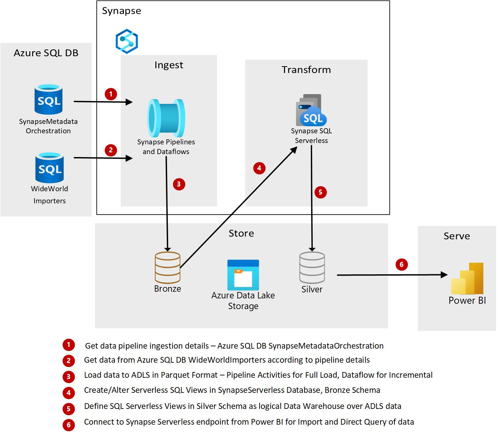
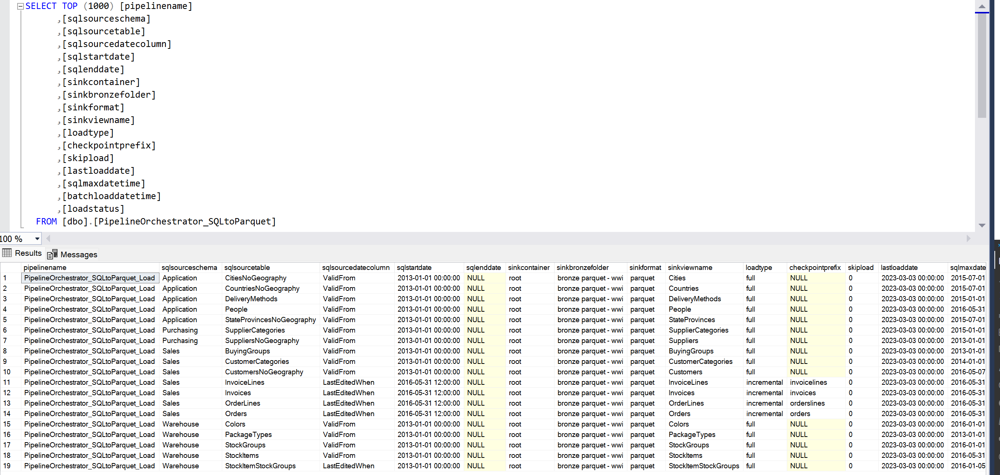
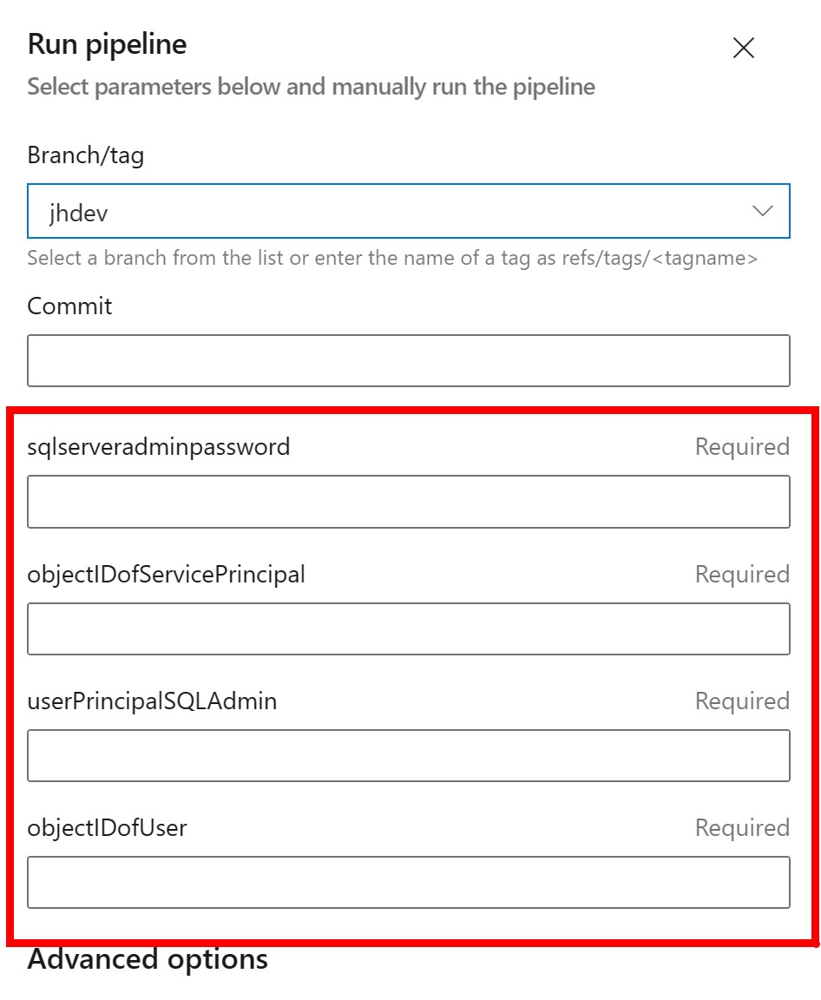
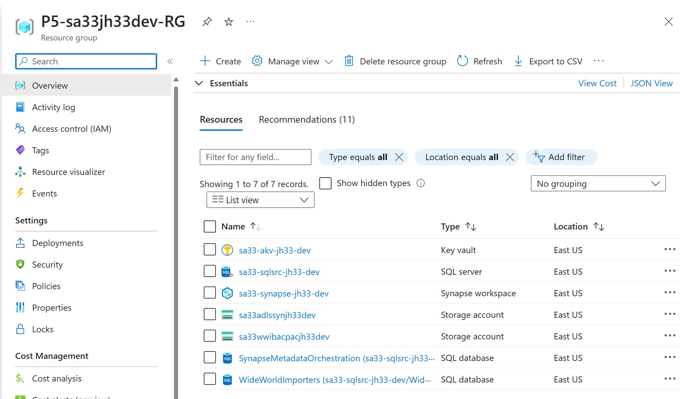
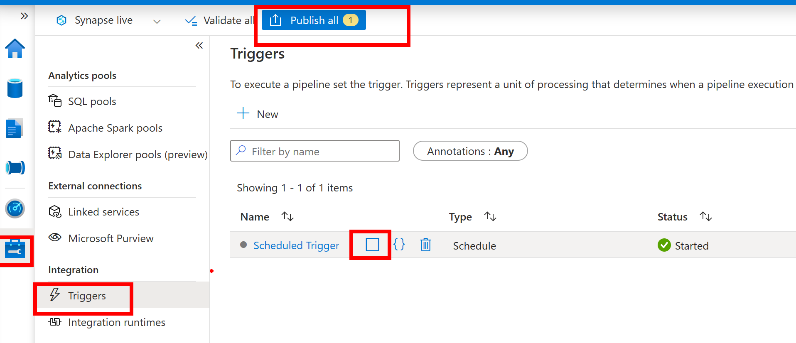
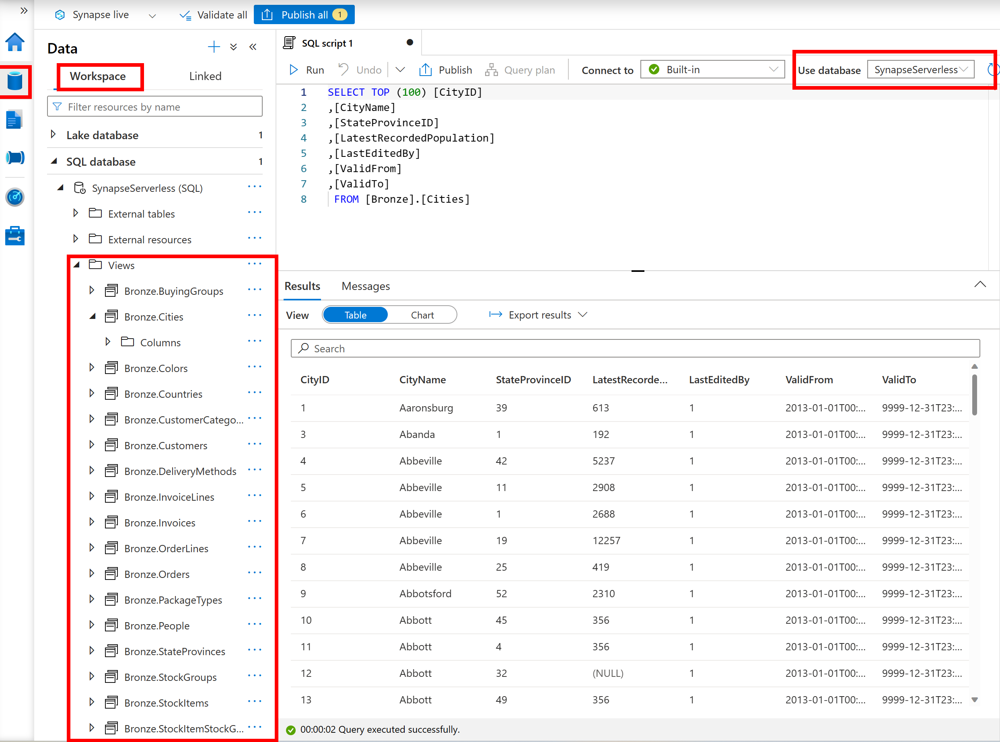
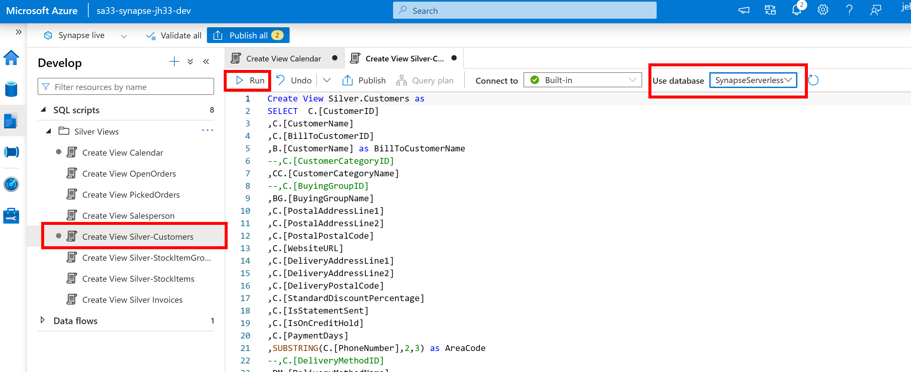

# Pattern 5: Azure Synapse Analytics Metadata Driven Pipelines with Synapse Serverless Logical Data Warehouse

## Description
Synapse Analytics and Azure Data Factory pipelines give data engineers the capability to build reuseable metadata-driven pipelines that are fun to create, save hours of development time, are easy to maintain, and are CI/CD friendly. Additionally, 
Synapse Serverless SQL can give end users near real-time access to data without waiting for lengthy data transformations.

This solution demonstrates both of these concepts - metadata driven pipelines and Synapse Serverless SQL. The solution includes creating a metadata database which holds the information about what tables to load from a source database and how to load them into Azure Data Lake Storage Gen2(ADLS). Small tables are fully reloaded while large files are incrementally loaded and partitioned into parquet files.

If a new table needs to be added to the ETL process, the data engineer does not need to build a new dataset or pipeline at all - they only need to add a new row to a table in the metadata database and the table will automatically load on the next pipeline run.

 For each ADLS file landed, a view is automatically created in the Synapse Serverless Database. Additional views can be created to build a star schema, the optimal data structure for Power BI, Synapse Dedicated Pools and other data reporting platforms.

## Architecture
Below is a high-level diagram of the solution.


## Prerequisites
* An active Azure subscription.
* An Azure Active Directory user account for Azure Active Directory(AAD) access to Azure SQL DB and Azure Storage Account. Make note of the object id of this account. This can be found by looking up the user in AAD or by running the Azure CLI command:

    ```azurecli-interactive
        az ad user show --id useremail@xxx123.com --query id
    ```

* An active Azure DevOps account.
* Service Principal has to be created and should be given Owner access over subscription, so that it can create new resource group and resources during the deployment. 
If "Owner" access can't be given, then assign it to a custom role which has access to the following: </br> Microsoft.Authorization/roleAssignments/
* [Create an Azure Resource Manager service connection](https://docs.microsoft.com/en-us/azure/devops/pipelines/library/service-endpoints?view=azure-devops&tabs=yaml#create-a-service-connection) from the Azure DevOps pipeline to connect the Azure subscription. Make note of the service principal object id. This can be found by going to AAD-> App Registrations then select the app registration display name, then select the display name again under "Managed application in local directory" or by running the Azure CLI command: 

    ```azurecli
        az ad sp list --display-name yourappregistrationname
    ```

* [Create a github service connection](https://docs.microsoft.com/en-us/azure/devops/pipelines/library/service-endpoints?view=azure-devops&tabs=yaml#github-service-connection) to connect to the github repo.

## Azure Resources
Here are the Azure resources that are being deployed for the streaming pattern.

1. **Azure Resource Group** - A new Azure Resource group for all resources deployed in this solution.
1. **Azure SQL DB** - An Azure SQL DB Server is deployed with two  Azure SQL Databases:
    1. [WideWorldImporters Standard sample database](https://learn.microsoft.com/en-us/sql/samples/wide-world-importers-oltp-database-catalog?view=azuresqldb-current) which is the source for the solution. The deployment includes creating several views in this database that are leveraged in the Synapse pipeline.
    1. SynapseMetadataOrchestration database is created along with a table which contains the ETL information for each table to load from WideWorldImporters.
1. **Azure Synapse Workspace** - The following components from the Azure Synapse workspace are being used:
   - *Azure Synapse Linked Services*: Parameterized connections to other data stores.
   - *Azure Synapse Integration datasets*: 3 parameterized integrated datasets (one for source, one for sink, one for the metadata table)
   - *Azure Synapse Pipelines*: Pipelines to orchestrate and load the data.
   - *Azure Synapse Dataflow*: Dataflow for tables that are loaded incrementally and partitioned in ADLS.
   - *Azure Synapse Serverless SQL pool*: A TSQL endpoint to query the parquet tables hosted in ADLS.
   - *Azure Synapse Serverless SQL Database*: Serverless SQL database and schemas for views over the ADLS files.
   
   - *Azure Synapse Trigger*: A default trigger which is parameterized with the data and run details for your deployed solution.
1.  **Azure Data Lake Storage Gen2 (ADLS)** -Two ADLS storage accounts are used in this solution:
    1. Default Synapse Analytics storage for the ingested data in parquet format. The AAD user account will be granted Blob Storage Contributor.
    1. Another ADLS account that was needed during the deployment process to import the Wide World Importers database.
1.  **Azure Key Vault** - Secret store.
1.  **Azure Devops pipeline** - A CI/CD pipeline to deploy all of the components in the solution into Azure.


## Deployment Steps

1. Clone the repo: https://github.com/Azure/AnalyticsinaBox/tree/main/src/bicep-deployment/Pattern5
1. Update the configuration file with new values: ..\src\bicep-deployment\pattern5\config-infra-dev-streaming.yml
    - location: eastus 
    - prefix: xxx
    - postfix: x12
    - environment: dev
    - ado_service_connection_rg: < *Name of ADO Service Connection* >

1. Go to the Azure DevOps and create a new Pipeline. Choose Github and map the yml file from the Github repo
   
1. Save and Run. The pipeline will prompt SQL Server password, the Object ID of the Service Principal, the User Email for SQL AAD authentication, and the Object ID for that same user.
   
1. Here are the resources that will be created after deployment:


## Post Deployment

1. Give the AAD user account Owner access to the Synapse Workspace in the Azure portal. Wait a few minutes to give your tenant time to update the access before continuing to the next step.
1. Add the AAD use account as the Synapse Workspace Admin in Synapse Studio. Otherwise, the user will not be able to see the pipelines and the other components when you open the synapse workspace. Synapse workspace > Access Control -> add your logged in account as "Synapse Administrator"
1. Give the Synapse Managed Identity access to the Azure SQL DBs.
    1. Connect to the Azure SQL DB Server in SQL Server Management Studio or Azure Data Studio ***using AAD authentication***.
    1. Connect to the WideWorldImporters database and run the following commands:
    
         ```sql 
         CREATE USER [yoursysnapseanalyticcsworkspacename] FROM EXTERNAL PROVIDER  WITH DEFAULT_SCHEMA=[dbo];
         ALTER ROLE db_owner ADD MEMBER [yoursysnapseanalyticcsworkspacename]
        ```

    1. Connect to the SynapseMetadataOrchestration database and run the same commands above, in step b.
## Start Solution
1. Navigate to the Synapse Pipeline named: 'orchestrator Load Source SQL to Bronze ADLS'.
1. Click on **Trigger -> New/Edit**
1. Click on the number 9 in the Parameters column: 
1. Review the parameter values. You can see that the parameter values are populated with the Azure resources you deployed.
1. You now have 2 options for running the pipeline.
    1. You can either copy the parameter values from the trigger and paste them in as pipeline defaults and run the pipeline in debug:
    
    **OR**
    1. Go to the Scheduled Trigger in the Manage -> Triggers section, click the Start button, then select Publish all:  The trigger will start in about 5 minutes. ***But as soon you see that the trigger has started in the Monitor Pane, go back to Manage Triggers,press Stop then Publish all again. If you choose this option, you must stop the trigger to avoid excess charges.***
    

    
1. After your pipeline has completed, go to your Synapse Serverless SQL database and you will see Views in the Bronze schema. Along with loading data from your WorldWideImporters database into your data lake, these views were created as part of the pipeline. Explore these views at your leisure.
    
1. Navigate to the Develop pane and you will see scripts for views to be stored in the Silver schema of the Synapse Serverless SQL database. Open each script and run them in the SynapseServerless database. Note: there is no need to publish after running the view scripts unless you change the scripts and want to save the changes you made. The SQL views will be created immediately.
   

## Further Ideas
Consider the ideas below for futher exploration and enhancement to the solution

### Learn more about parameterization and dynamic expressions for metadata driven pipelines

Review all the linked services, data integration sets, and activities in the Synapse Studio solution. See how values from the metadata database as well as from activity outputs and trigger values are leveraged throughout in dynamic expressions and parameters.

[Build metadata driven pipelines in ADF](https://techcommunity.microsoft.com/t5/fasttrack-for-azure/build-metadata-driven-pipelines-in-azure-data-factory/ba-p/3443328)

[How to user parameters, expressions and functions in ADF/Synapse](https://learn.microsoft.com/en-us/azure/data-factory/how-to-expression-language-functions)

[Parameterizing mapping data flows](https://learn.microsoft.com/en-us/azure/data-factory/parameters-data-flow)

### Read further about creating a logical Enterprise Data Warehouse with Synapse Severless Pools and connecting to it from SSMS and Power BI
[Build a logical Enterprise Data Warehouse with ADLS and Synapse Serverless SQL pool](https://techcommunity.microsoft.com/t5/fasttrack-for-azure/build-a-logical-enterprise-data-warehouse-with-adls-and-synapse/ba-p/3622092)

### Test the incremental loads by adding more data to the WideWorldImporter database
[Data generation in WideWorldImporters](https://learn.microsoft.com/en-us/sql/samples/wide-world-importers-generate-data?source=recommendations&view=sql-server-ver16)

### Connect you Synapse Solution to Azure DevOps or GitHub for Source Control and CI/CD
[CI/CD with Synapse and Azure DevOps](https://techcommunity.microsoft.com/t5/data-architecture-blog/ci-cd-in-azure-synapse-analytics-part-5-deploying-azure-synapse/ba-p/2775403)

[Deploying Synapse Artifacts with Azure DevOps: Video](https://www.youtube.com/watch?v=UhpboCdNh1I)

## Contributing
This project welcomes contributions and suggestions.  Most contributions require you to agree to a
Contributor License Agreement (CLA) declaring that you have the right to, and actually do, grant us
the rights to use your contribution. For details, visit https://cla.opensource.microsoft.com.

When you submit a pull request, a CLA bot will automatically determine whether you need to provide
a CLA and decorate the PR appropriately (e.g., status check, comment). Simply follow the instructions
provided by the bot. You will only need to do this once across all repos using our CLA.

This project has adopted the [Microsoft Open Source Code of Conduct](https://opensource.microsoft.com/codeofconduct/).
For more information see the [Code of Conduct FAQ](https://opensource.microsoft.com/codeofconduct/faq/) or
contact [opencode@microsoft.com](mailto:opencode@microsoft.com) with any additional questions or comments.

## Trademarks
This project may contain trademarks or logos for projects, products, or services. Authorized use of Microsoft 
trademarks or logos is subject to and must follow 
[Microsoft's Trademark & Brand Guidelines](https://www.microsoft.com/en-us/legal/intellectualproperty/trademarks/usage/general).
Use of Microsoft trademarks or logos in modified versions of this project must not cause confusion or imply Microsoft sponsorship.
Any use of third-party trademarks or logos are subject to those third-party's policies.
